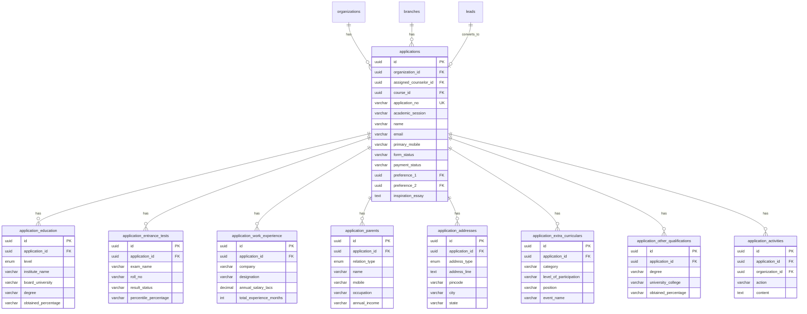

# Application Module — Backend Implementation Plan

> **Source of truth**: [application.pdf](./application.pdf) (4-page form), frontend list page, frontend detail page  
> **Stack**: NestJS · TypeORM · PostgreSQL · Existing auth/guard infrastructure  
> **Date**: 2026-06-12

---

## 1. Overview

The Application module manages the **full lifecycle** of an admission application — from creation through review to acceptance/rejection. Every field from the PDF application form is captured across **normalized, scalable tables** so that sections (education, entrance tests, work experience, etc.) can grow independently without schema changes.

### Key Design Decisions

- **Normalized tables** over a single JSONB blob — enables querying, indexing, reporting, and partial updates per section.
- **One-to-many child tables** for repeatable sections (entrance tests, education records, work experience, extra-curricular activities, other qualifications).
- **Auto-generated application numbers** using a DB sequence with org-specific prefix (e.g., `CHN/2026/0001`).
- **Follows existing patterns**: same guard stack (`JwtAuthGuard`, `RolesGuard`, `TenantGuard`), same response decorator, same module registration in `AppModule`.

---

## 1.1 Business Rules & Authorization

The following business rules **must** be enforced at the backend service layer and are **non-negotiable**. They apply across all API entry points (controller, service, and future integrations).

### Rule 1: Counselor-Scoped Application Creation

> **Counselors can create applications ONLY for leads assigned to them.**

- The `POST /` (create application) endpoint accepts a `leadId` parameter.
- When the authenticated user's role is `counselor`:
  1. `leadId` is **required** (a counselor cannot create a standalone application).
  2. The service must verify that `leads.assigned_to === req.user.sub` for the given lead.
  3. If the lead is not assigned to the counselor, throw `403 Forbidden`.
- Roles `superadmin`, `org_admin`, and `application_manager` may create applications for any lead or without a lead.
- **Already implemented** in `applications.service.ts` (lines 126–141) — must be preserved and documented here.

| Creator Role | `leadId` Required? | Ownership Check |
|:---|:---|:---|
| `superadmin` | No | None |
| `org_admin` | No | None |
| `application_manager` | No | None |
| `counselor` | **Yes** | `lead.assignedTo === user.sub` |

### Rule 2: Post-Submission Data Lock

> **Once an application is submitted, all data fields are locked. Only status updates can be made — and only by managers.**

- When `form_status = 'submitted'` (or any post-submission status: `under_review`, `accepted`, `rejected`):
  - All section-level `PATCH` endpoints (`/personal`, `/education`, `/preferences`, etc.) must **reject** the request with `400 Bad Request` and message: `"Application data cannot be modified after submission"`.
  - The **only** mutation allowed is `PATCH /:applicationNo/status` to transition the workflow state.
- **Status update authorization**:
  - Only `superadmin`, `org_admin`, and `application_manager` roles can change status after submission.
  - Counselors are excluded from the `PATCH /:applicationNo/status` endpoint (already enforced via `@Roles` decorator).
- The service must implement a guard method:
  ```typescript
  private assertEditable(application: Application): void {
    const lockedStatuses = ['submitted', 'under_review', 'accepted', 'rejected'];
    if (lockedStatuses.includes(application.form_status)) {
      throw new BadRequestException(
        'Application data cannot be modified after submission',
      );
    }
  }
  ```
  This method must be called at the top of **every** section-level PATCH handler.

### Rule 3: Preference Locations Are Organization Branches

> **Preference 1 and Preference 2 are references to the `branches` table of the organization, not free-text.**

- The `preference_1` and `preference_2` columns in the `applications` table store **branch UUIDs** (FK to `branches.id`).
- The backend must validate that each preference ID:
  1. Exists in the `branches` table.
  2. Belongs to the same `organization_id` as the application.
  3. Is an active branch (`is_active = TRUE`).
- The API response serializes preferences with both the branch ID and display name:
  ```json
  "preferences": {
    "preference1": { "branchId": "uuid", "name": "PGDM CHENNAI" },
    "preference2": { "branchId": "uuid", "name": "PGDM KOCHI" }
  }
  ```
- **Frontend alignment note**: The frontend detail page currently renders `applicationData.preferences.preference1` as a string. The frontend `EditPreferencesForm` uses hardcoded `<SelectItem>` values (`"Main Campus"`, `"City Campus"`, `"South Campus"`). These must be updated to fetch branches from the `/branches` API and use branch IDs.

### Rule 4: Academic Session Isolation (No Duplicate Active Applications)

> **A student cannot have more than one active application for the same course within the same academic session. However, a student CAN have multiple applications for different courses.**

- Uniqueness is enforced by a **partial unique index** on the `applications` table:
  ```sql
  CREATE UNIQUE INDEX IF NOT EXISTS idx_applications_unique_active
    ON applications (organization_id, email, course_id, academic_session)
    WHERE form_status NOT IN ('rejected');
  ```
- The service must also perform a **pre-check** before insert:
  ```typescript
  const duplicate = await queryRunner.manager.findOne(Application, {
    where: {
      organizationId: orgId,
      email: dto.applicant.email,
      courseId: dto.courseId,
      academicSession: dto.academicSession,
      formStatus: Not(In(['rejected'])),
    },
  });
  if (duplicate) {
    throw new BadRequestException(
      `An active application already exists for this email (${dto.applicant.email}) ` +
      `in course ${dto.courseId} for academic session ${dto.academicSession}`,
    );
  }
  ```
- **Key clarification**: The uniqueness is scoped to `(organization_id, email, course_id, academic_session)`. A student with the **same email** can submit multiple applications for **different courses** in the **same session**.
- The `course_id` column replaces the previous free-text `program` field for uniqueness enforcement. The `program` column remains as a display label.
- `academic_session` (e.g., `'2025-26'`) is **required** and **NOT NULL**.

---

## 2. Database Schema — All Tables

### 2.1 ENUM Types

```sql
-- Application form status
DO $$
BEGIN
    IF NOT EXISTS (SELECT 1 FROM pg_type WHERE typname = 'application_form_status_enum') THEN
        CREATE TYPE application_form_status_enum AS ENUM (
            'incomplete', 'in_progress', 'submitted', 'under_review', 'accepted', 'rejected'
        );
    END IF;
END $$;

-- Application payment status
DO $$
BEGIN
    IF NOT EXISTS (SELECT 1 FROM pg_type WHERE typname = 'application_payment_status_enum') THEN
        CREATE TYPE application_payment_status_enum AS ENUM (
            'pending', 'paid', 'refunded'
        );
    END IF;
END $$;

-- Education level
DO $$
BEGIN
    IF NOT EXISTS (SELECT 1 FROM pg_type WHERE typname = 'education_level_enum') THEN
        CREATE TYPE education_level_enum AS ENUM (
            '10th', '12th', 'diploma', 'graduation', 'post_graduation'
        );
    END IF;
END $$;

-- Entrance test result status
DO $$
BEGIN
    IF NOT EXISTS (SELECT 1 FROM pg_type WHERE typname = 'entrance_result_status_enum') THEN
        CREATE TYPE entrance_result_status_enum AS ENUM (
            'declared', 'awaiting_result', 'not_appeared'
        );
    END IF;
END $$;

-- Parent/Guardian type
DO $$
BEGIN
    IF NOT EXISTS (SELECT 1 FROM pg_type WHERE typname = 'guardian_type_enum') THEN
        CREATE TYPE guardian_type_enum AS ENUM (
            'father', 'mother', 'guardian'
        );
    END IF;
END $$;

-- Address type
DO $$
BEGIN
    IF NOT EXISTS (SELECT 1 FROM pg_type WHERE typname = 'address_type_enum') THEN
        CREATE TYPE address_type_enum AS ENUM (
            'present', 'permanent'
        );
    END IF;
END $$;
```

---

### 2.2 `applications` — Master Table

This is the **core table**. One row = one application.

```sql
CREATE TABLE IF NOT EXISTS applications (
    id                      UUID PRIMARY KEY DEFAULT uuid_generate_v4(),
    organization_id         UUID                NOT NULL,
    branch_id               UUID,
    lead_id                 UUID,                -- optional link back to leads table
    assigned_counselor_id   UUID,                -- counselor who created this application (for audit trail)

    -- Auto-generated application number (e.g. CHN/2026/0001)
    application_no          VARCHAR(50)         NOT NULL UNIQUE,
    academic_session        VARCHAR(20)         NOT NULL,  -- e.g. '2025-26' (renamed from academic_year, now NOT NULL)
    course_id               UUID,                -- FK to courses table, used for duplicate prevention
    program                 VARCHAR(255),        -- display label e.g. 'PGDM', 'MBA'

    -- Photo
    photo_url               VARCHAR(500),

    -- Form & Payment status
    form_status             application_form_status_enum NOT NULL DEFAULT 'incomplete',
    payment_status          application_payment_status_enum NOT NULL DEFAULT 'pending',
    payment_mode            VARCHAR(50),        -- 'Online', 'UPI', 'Net Banking', 'Credit Card', etc.
    payment_amount          DECIMAL(10, 2)      DEFAULT 0,
    payment_date            TIMESTAMP,
    payment_reference       VARCHAR(100),       -- transaction ID

    -- Campus/Location Preferences (FK to branches table — Rule 3)
    preference_1            UUID,               -- FK to branches.id (e.g. Chennai campus)
    preference_2            UUID,               -- FK to branches.id (e.g. Kochi campus)

    -- Personal Details (PDF Page 1)
    name                    VARCHAR(255)        NOT NULL,
    email                   VARCHAR(255)        NOT NULL,
    primary_mobile          VARCHAR(50)         NOT NULL,
    alternate_mobile        VARCHAR(50),
    gender                  VARCHAR(20),        -- 'Male', 'Female', 'Other'
    date_of_birth           DATE,
    age_as_on_reference     VARCHAR(50),        -- 'X Years, Y Days' (computed / stored)
    religion                VARCHAR(50),
    nationality             VARCHAR(50)         DEFAULT 'Indian',
    aadhaar_number          VARCHAR(20),
    category                VARCHAR(20),        -- 'GEN', 'OBC', 'SC', 'ST', 'EWS'
    marital_status          VARCHAR(20),        -- 'Unmarried', 'Married', 'Divorced', 'Widowed'
    spouse_name             VARCHAR(255),
    spouse_occupation       VARCHAR(255),

    -- Additional Info (PDF Page 3)
    inspiration_essay       TEXT,               -- "What inspires you to pursue PGDM/MBA..."
    how_did_you_know        VARCHAR(255),       -- 'Education Portals', 'Social Media', etc.
    has_medical_condition   BOOLEAN             DEFAULT FALSE,
    medical_condition_details TEXT,

    -- Declaration (PDF Page 4)
    declaration_accepted    BOOLEAN             DEFAULT FALSE,
    declaration_applicant_name VARCHAR(255),
    declaration_parent_name VARCHAR(255),
    declaration_date        DATE,
    declaration_place       VARCHAR(100),

    -- Metadata
    submitted_at            TIMESTAMP,
    last_activity_at        TIMESTAMP           DEFAULT NOW(),

    -- Audit
    created_by              UUID,
    updated_by              UUID,
    created_at              TIMESTAMP           NOT NULL DEFAULT NOW(),
    updated_at              TIMESTAMP           NOT NULL DEFAULT NOW(),

    CONSTRAINT fk_applications_organization
        FOREIGN KEY (organization_id)
        REFERENCES organizations(id)
        ON DELETE CASCADE,

    CONSTRAINT fk_applications_branch
        FOREIGN KEY (branch_id)
        REFERENCES branches(id)
        ON DELETE SET NULL,

    CONSTRAINT fk_applications_lead
        FOREIGN KEY (lead_id)
        REFERENCES leads(id)
        ON DELETE SET NULL,

    CONSTRAINT fk_applications_counselor
        FOREIGN KEY (assigned_counselor_id)
        REFERENCES users(id)
        ON DELETE SET NULL,

    CONSTRAINT fk_applications_preference_1
        FOREIGN KEY (preference_1)
        REFERENCES branches(id)
        ON DELETE SET NULL,

    CONSTRAINT fk_applications_preference_2
        FOREIGN KEY (preference_2)
        REFERENCES branches(id)
        ON DELETE SET NULL
);
```

---

### 2.3 `application_education` — Education Records (1:N)

Covers: **10th, 12th, Diploma, Graduation, Post-Graduation** — all in one table with a `level` discriminator. Each level has its own row.

```sql
CREATE TABLE IF NOT EXISTS application_education (
    id                      UUID PRIMARY KEY DEFAULT uuid_generate_v4(),
    application_id          UUID                NOT NULL,
    level                   education_level_enum NOT NULL,  -- '10th', '12th', 'diploma', 'graduation', 'post_graduation'

    -- Common fields (all levels)
    institute_name          VARCHAR(500),
    board_university        VARCHAR(500),       -- Board for 10th/12th, University for UG/PG
    stream                  VARCHAR(255),
    year_of_passing         VARCHAR(10),
    obtained_percentage     VARCHAR(20),        -- e.g. '84', '91.2%', 'CGPA 8.5'

    -- Extended fields (Graduation / Post-Graduation)
    state                   VARCHAR(100),
    college_institute       VARCHAR(500),       -- Graduation College / Institute name
    degree                  VARCHAR(255),       -- e.g. 'BCOM ACCOUNTING AND FINANCE'
    degree_mode             VARCHAR(50),        -- 'Regular', 'Distance', 'Part Time'
    result_status           VARCHAR(50),        -- 'Completed', 'Awaited', 'In Progress'
    year_of_enrollment      VARCHAR(10),
    percentage_till_last_sem VARCHAR(20),       -- e.g. '86'
    obtained_percentage_e_till_last VARCHAR(20), -- alternate column for "obtained percentage e till last semester"

    -- Post-Graduation specific
    has_post_graduation     BOOLEAN             DEFAULT FALSE,  -- stored at graduation level row

    created_at              TIMESTAMP           NOT NULL DEFAULT NOW(),
    updated_at              TIMESTAMP           NOT NULL DEFAULT NOW(),

    CONSTRAINT fk_edu_application
        FOREIGN KEY (application_id)
        REFERENCES applications(id)
        ON DELETE CASCADE
);
```

---

### 2.4 `application_other_qualifications` — Other Qualifications (1:N)

From PDF Page 2: "Do You Have Any Other Qualification?" — repeatable rows.

```sql
CREATE TABLE IF NOT EXISTS application_other_qualifications (
    id                      UUID PRIMARY KEY DEFAULT uuid_generate_v4(),
    application_id          UUID                NOT NULL,

    degree                  VARCHAR(255),
    university_college      VARCHAR(500),
    stream                  VARCHAR(255),
    degree_mode             VARCHAR(50),
    year_of_enrollment      VARCHAR(10),
    year_of_passing         VARCHAR(10),
    obtained_percentage     VARCHAR(20),

    created_at              TIMESTAMP           NOT NULL DEFAULT NOW(),

    CONSTRAINT fk_other_qual_application
        FOREIGN KEY (application_id)
        REFERENCES applications(id)
        ON DELETE CASCADE
);
```

---

### 2.5 `application_entrance_tests` — Entrance Test Details (1:N)

From PDF Page 1: XAT, CAT, CMAT, MAT, GMAT, TANCET, K-MAT(Kerala MAT)

```sql
CREATE TABLE IF NOT EXISTS application_entrance_tests (
    id                      UUID PRIMARY KEY DEFAULT uuid_generate_v4(),
    application_id          UUID                NOT NULL,

    exam_name               VARCHAR(50)         NOT NULL,  -- 'XAT', 'CAT', 'CMAT', 'MAT', 'GMAT', 'TANCET', 'K-MAT'
    roll_no                 VARCHAR(50),
    exam_month              VARCHAR(20),        -- '01/2025', '11/2025'
    result_status           VARCHAR(50),        -- 'Declared', 'Awaiting Result', '-'
    score                   VARCHAR(20),        -- raw score or '-'
    percentile_percentage   VARCHAR(20),        -- '58.22', '88.22', '-'

    created_at              TIMESTAMP           NOT NULL DEFAULT NOW(),
    updated_at              TIMESTAMP           NOT NULL DEFAULT NOW(),

    CONSTRAINT fk_entrance_application
        FOREIGN KEY (application_id)
        REFERENCES applications(id)
        ON DELETE CASCADE
);
```

---

### 2.6 `application_work_experience` — Work Experience (1:N)

From PDF Page 2–3: Up to 3 entries + total experience.

```sql
CREATE TABLE IF NOT EXISTS application_work_experience (
    id                      UUID PRIMARY KEY DEFAULT uuid_generate_v4(),
    application_id          UUID                NOT NULL,

    company                 VARCHAR(500),
    designation             VARCHAR(255),
    annual_salary_lacs      DECIMAL(10, 2),
    nature_of_responsibilities TEXT,
    from_year               VARCHAR(10),
    to_year                 VARCHAR(10),
    total_experience_months INTEGER,

    created_at              TIMESTAMP           NOT NULL DEFAULT NOW(),

    CONSTRAINT fk_work_exp_application
        FOREIGN KEY (application_id)
        REFERENCES applications(id)
        ON DELETE CASCADE
);
```

> The **total work experience** (in months) is stored on the `applications` table as a computed/summary field:
> ```sql
> ALTER TABLE applications ADD COLUMN IF NOT EXISTS total_work_experience_months INTEGER DEFAULT 0;
> ALTER TABLE applications ADD COLUMN IF NOT EXISTS has_work_experience BOOLEAN DEFAULT FALSE;
> ```

---

### 2.7 `application_parents` — Parent / Guardian Details (1:N, max 3)

From PDF Page 3: Father, Mother, Guardian — each as a separate row.

```sql
CREATE TABLE IF NOT EXISTS application_parents (
    id                      UUID PRIMARY KEY DEFAULT uuid_generate_v4(),
    application_id          UUID                NOT NULL,

    relation_type           guardian_type_enum   NOT NULL,  -- 'father', 'mother', 'guardian'
    name                    VARCHAR(255),
    mobile                  VARCHAR(50),
    email                   VARCHAR(255),
    occupation              VARCHAR(255),
    annual_income           VARCHAR(50),        -- e.g. '5,00,000-10,00,000' (range string)
    relationship_with_student VARCHAR(100),     -- only for guardian type

    created_at              TIMESTAMP           NOT NULL DEFAULT NOW(),
    updated_at              TIMESTAMP           NOT NULL DEFAULT NOW(),

    CONSTRAINT fk_parents_application
        FOREIGN KEY (application_id)
        REFERENCES applications(id)
        ON DELETE CASCADE
);
```

---

### 2.8 `application_addresses` — Address Details (1:N, max 2)

From PDF Page 3: Present Address + Permanent Address, each with full breakdown.

```sql
CREATE TABLE IF NOT EXISTS application_addresses (
    id                      UUID PRIMARY KEY DEFAULT uuid_generate_v4(),
    application_id          UUID                NOT NULL,

    address_type            address_type_enum    NOT NULL,  -- 'present', 'permanent'
    address_line            TEXT,
    pincode                 VARCHAR(10),
    city                    VARCHAR(100),
    state                   VARCHAR(100),
    country                 VARCHAR(100)        DEFAULT 'India',
    is_same_as_present      BOOLEAN             DEFAULT FALSE,  -- only relevant for 'permanent'

    created_at              TIMESTAMP           NOT NULL DEFAULT NOW(),
    updated_at              TIMESTAMP           NOT NULL DEFAULT NOW(),

    CONSTRAINT fk_addresses_application
        FOREIGN KEY (application_id)
        REFERENCES applications(id)
        ON DELETE CASCADE
);
```

---

### 2.9 `application_extra_curriculars` — Extra-Curricular Activities (1:N, up to 4)

From PDF Page 3.

```sql
CREATE TABLE IF NOT EXISTS application_extra_curriculars (
    id                      UUID PRIMARY KEY DEFAULT uuid_generate_v4(),
    application_id          UUID                NOT NULL,

    category                VARCHAR(255),       -- e.g. 'Sports', 'Cultural', 'Academic'
    level_of_participation  VARCHAR(100),       -- 'School', 'District', 'State', 'National', 'International'
    position                VARCHAR(100),       -- e.g. 'Winner', 'Runner-up', 'Participant'
    event_name              VARCHAR(255),

    created_at              TIMESTAMP           NOT NULL DEFAULT NOW(),

    CONSTRAINT fk_extra_curr_application
        FOREIGN KEY (application_id)
        REFERENCES applications(id)
        ON DELETE CASCADE
);
```

---

### 2.10 `application_activities` — Activity / Audit Log (1:N)

Tracks status changes, edits, notes — mirroring the pattern from `lead_activities`.

```sql
CREATE TABLE IF NOT EXISTS application_activities (
    id                      UUID PRIMARY KEY DEFAULT uuid_generate_v4(),
    application_id          UUID                NOT NULL,
    organization_id         UUID                NOT NULL,
    actor_id                UUID,               -- user who performed the action
    action                  VARCHAR(50)         NOT NULL,  -- 'created', 'submitted', 'status_changed', 'section_updated', 'note_added', 'deleted'
    content                 TEXT,               -- human-readable description or note
    previous_status         VARCHAR(50),
    new_status              VARCHAR(50),
    section_updated         VARCHAR(50),        -- 'personal', 'education', 'entrance', 'parents', etc.
    created_at              TIMESTAMP           NOT NULL DEFAULT NOW(),

    CONSTRAINT fk_app_activities_application
        FOREIGN KEY (application_id)
        REFERENCES applications(id)
        ON DELETE CASCADE,

    CONSTRAINT fk_app_activities_org
        FOREIGN KEY (organization_id)
        REFERENCES organizations(id)
        ON DELETE CASCADE
);
```

---

### 2.11 Indexes

```sql
-- applications
CREATE INDEX IF NOT EXISTS idx_applications_org_id          ON applications(organization_id);
CREATE INDEX IF NOT EXISTS idx_applications_branch_id       ON applications(branch_id);
CREATE INDEX IF NOT EXISTS idx_applications_lead_id         ON applications(lead_id);
CREATE INDEX IF NOT EXISTS idx_applications_application_no  ON applications(application_no);
CREATE INDEX IF NOT EXISTS idx_applications_email           ON applications(email);
CREATE INDEX IF NOT EXISTS idx_applications_phone           ON applications(primary_mobile);
CREATE INDEX IF NOT EXISTS idx_applications_form_status     ON applications(form_status);
CREATE INDEX IF NOT EXISTS idx_applications_payment_status  ON applications(payment_status);
CREATE INDEX IF NOT EXISTS idx_applications_submitted_at    ON applications(submitted_at);
CREATE INDEX IF NOT EXISTS idx_applications_counselor_id    ON applications(assigned_counselor_id);
CREATE INDEX IF NOT EXISTS idx_applications_course_id       ON applications(course_id);
CREATE INDEX IF NOT EXISTS idx_applications_academic_session ON applications(academic_session);

-- Academic Session Isolation: prevent duplicate active applications per email/course/session (Rule 4)
CREATE UNIQUE INDEX IF NOT EXISTS idx_applications_unique_active
    ON applications (organization_id, email, course_id, academic_session)
    WHERE form_status NOT IN ('rejected');

-- child tables
CREATE INDEX IF NOT EXISTS idx_app_education_app_id         ON application_education(application_id);
CREATE INDEX IF NOT EXISTS idx_app_entrance_app_id          ON application_entrance_tests(application_id);
CREATE INDEX IF NOT EXISTS idx_app_work_exp_app_id          ON application_work_experience(application_id);
CREATE INDEX IF NOT EXISTS idx_app_parents_app_id           ON application_parents(application_id);
CREATE INDEX IF NOT EXISTS idx_app_addresses_app_id         ON application_addresses(application_id);
CREATE INDEX IF NOT EXISTS idx_app_extra_curr_app_id        ON application_extra_curriculars(application_id);
CREATE INDEX IF NOT EXISTS idx_app_other_qual_app_id        ON application_other_qualifications(application_id);
CREATE INDEX IF NOT EXISTS idx_app_activities_app_id        ON application_activities(application_id);
CREATE INDEX IF NOT EXISTS idx_app_activities_org_id        ON application_activities(organization_id);
```

---

## 3. Entity-Relationship Diagram



---

## 4. NestJS Module Structure

```
src/modules/applications/
├── applications.module.ts
├── applications.controller.ts
├── applications.service.ts
├── dto/
│   ├── create-application.dto.ts
│   ├── update-application.dto.ts
│   ├── update-personal.dto.ts
│   ├── update-preferences.dto.ts
│   ├── update-education.dto.ts
│   ├── update-entrance-tests.dto.ts
│   ├── update-parents.dto.ts
│   ├── update-addresses.dto.ts
│   ├── update-work-experience.dto.ts
│   ├── update-extra-curriculars.dto.ts
│   ├── update-other-qualifications.dto.ts
│   ├── update-additional-info.dto.ts
│   ├── update-declaration.dto.ts
│   ├── update-payment.dto.ts
│   ├── application-query.dto.ts
│   └── add-application-note.dto.ts
└── entities/
    ├── application.entity.ts
    ├── application-education.entity.ts
    ├── application-entrance-test.entity.ts
    ├── application-work-experience.entity.ts
    ├── application-parent.entity.ts
    ├── application-address.entity.ts
    ├── application-extra-curricular.entity.ts
    ├── application-other-qualification.entity.ts
    └── application-activity.entity.ts
```

---

## 5. API Endpoints

All endpoints scoped under: `organizations/:orgId/applications`

### 5.1 Application List & CRUD

| Method   | Endpoint                                   | Description                              | Roles                                       |
| :------- | :----------------------------------------- | :--------------------------------------- | :------------------------------------------ |
| `GET`    | `/`                                        | List all applications (paginated, filtered, searchable) | `superadmin`, `org_admin`, `application_manager`, `counselor` |
| `POST`   | `/`                                        | Create a new application (counselors: only for assigned leads — Rule 1) | `superadmin`, `org_admin`, `application_manager`, `counselor` |
| `GET`    | `/:applicationNo`                          | Get full application detail by app number | `superadmin`, `org_admin`, `application_manager`, `counselor` |
| `DELETE` | `/:applicationNo`                          | Delete an application                    | `superadmin`, `org_admin`                   |

### 5.2 Section-Level Updates (PATCH per section)

Each section of the application form is updated independently — matching the frontend's edit dialogs.

> ⚠️ **Rule 2 — Post-Submission Lock**: ALL section-level PATCH endpoints below are **blocked** when `form_status ∈ {submitted, under_review, accepted, rejected}`. The service calls `assertEditable(application)` before processing any data mutation. Only `PATCH /:applicationNo/status` remains available after submission.

| Method   | Endpoint                                       | Description                         | Post-Submit Lock |
| :------- | :--------------------------------------------- | :---------------------------------- | :--------------- |
| `PATCH`  | `/:applicationNo/personal`                     | Update personal details             | 🔒 Locked |
| `PATCH`  | `/:applicationNo/preferences`                  | Update campus preferences (branch IDs — Rule 3) | 🔒 Locked |
| `PATCH`  | `/:applicationNo/education`                    | Update education records (all levels) | 🔒 Locked |
| `PATCH`  | `/:applicationNo/entrance-tests`               | Update entrance test details        | 🔒 Locked |
| `PATCH`  | `/:applicationNo/parents`                      | Update parent/guardian details      | 🔒 Locked |
| `PATCH`  | `/:applicationNo/addresses`                    | Update address details              | 🔒 Locked |
| `PATCH`  | `/:applicationNo/work-experience`              | Update work experience entries      | 🔒 Locked |
| `PATCH`  | `/:applicationNo/extra-curriculars`            | Update extra-curricular activities  | 🔒 Locked |
| `PATCH`  | `/:applicationNo/other-qualifications`         | Update other qualifications         | 🔒 Locked |
| `PATCH`  | `/:applicationNo/additional-info`              | Update essay, source, medical info  | 🔒 Locked |
| `PATCH`  | `/:applicationNo/declaration`                  | Update declaration details          | 🔒 Locked |
| `PATCH`  | `/:applicationNo/payment`                      | Update payment status/details       | 🔒 Locked |

### 5.3 Workflow Actions

| Method   | Endpoint                                   | Description                              | Roles |
| :------- | :----------------------------------------- | :--------------------------------------- | :---- |
| `PATCH`  | `/:applicationNo/submit`                   | Submit the application (status → submitted, triggers data lock — Rule 2) | `superadmin`, `org_admin`, `application_manager`, `counselor` |
| `PATCH`  | `/:applicationNo/status`                   | Change form status (review, accept, reject) — **post-submission only by managers (Rule 2)** | `superadmin`, `org_admin`, `application_manager` |
| `POST`   | `/:applicationNo/notes`                    | Add a note to the application timeline   | `superadmin`, `org_admin`, `application_manager`, `counselor` |
| `GET`    | `/:applicationNo/activities`               | Get activity/audit log for an application |

### 5.4 Export

| Method   | Endpoint                                   | Description                              |
| :------- | :----------------------------------------- | :--------------------------------------- |
| `GET`    | `/export/csv`                              | Export filtered applications to CSV      |

---

## 6. Query & Filter Parameters (GET `/`)

Matching the frontend's filter UI:

| Parameter        | Type     | Description                                          |
| :--------------- | :------- | :--------------------------------------------------- |
| `page`           | number   | Page number (default: 1)                             |
| `limit`          | number   | Items per page (default: 8)                          |
| `search`         | string   | Search by name, email, phone, or application number  |
| `formStatus`     | string   | Filter by form status                                |
| `paymentStatus`  | string   | Filter by payment status                             |
| `program`        | string   | Filter by preference_1 (program/campus)              |
| `campus`         | string   | Filter by preference_1 or preference_2               |
| `paymentMode`    | string   | Filter by payment mode                               |
| `dateFrom`       | string   | Filter last_activity_at >= dateFrom                  |
| `dateTo`         | string   | Filter last_activity_at <= dateTo                    |
| `applicationNo`  | string   | Filter by application number (partial match)         |

---

## 7. Application Detail Response Shape

The API response for `GET /:applicationNo` must match what the frontend expects:

```json
{
  "applicationNo": "CHN/2026/0001",
  "status": "Review Pending",
  "appliedFor": "PGDM 2025-26",
  "applicant": {
    "name": "MS. ANBUKARASI ARIVAZHAGAN",
    "photo": "https://...",
    "email": "anbukarasiarivazhagan963@gmail.com",
    "primaryMobile": "+91-9789886430",
    "alternateMobile": "+91-9444971643",
    "gender": "Female",
    "dob": "25/05/2005",
    "age": "20 Years, 7 Days",
    "religion": "Hinduism",
    "nationality": "Indian",
    "aadhaar": "871951392943",
    "category": "OBC",
    "maritalStatus": "Unmarried",
    "spouseName": null,
    "spouseOccupation": null
  },
  "preferences": {
    "preference1": { "branchId": "uuid-of-chennai-branch", "name": "PGDM CHENNAI" },
    "preference2": { "branchId": "uuid-of-kochi-branch", "name": "PGDM KOCHI" }
  },
  "entranceTests": [
    {
      "exam": "XAT",
      "rollNo": "-",
      "month": "-",
      "status": "-",
      "score": "-",
      "percentile": "-"
    },
    {
      "exam": "CMAT",
      "rollNo": "TN01000014",
      "month": "01/2025",
      "status": "Declared",
      "score": "-",
      "percentile": "58.22"
    }
  ],
  "education": {
    "tenth": {
      "institute": "ROSARY MATRICULATION",
      "board": "TAMIL NADU BOARD OF SECONDARY EDUCATION",
      "stream": "-",
      "year": "2020",
      "percentage": "66"
    },
    "twelfth": {
      "institute": "ROSARY MATRICULATION HIGHER SECONDARY SCHOOL",
      "board": "TAMIL NADU BOARD OF HIGHER SECONDARY EDUCATION",
      "stream": "Commerce",
      "year": "2022",
      "percentage": "98.6"
    },
    "diploma": null,
    "graduation": {
      "state": "Tamil Nadu",
      "university": "UNIVERSITY OF MADRAS, TAMIL NADU",
      "college": "MOP VASHNAV COLLEGE FOR WOMEN",
      "degree": "BCOM ACCOUNTING AND FINANCE",
      "mode": "Regular",
      "status": "Awaited",
      "enrollmentYear": "2022",
      "passingYear": "2025",
      "percentage": null,
      "percentageTillLast": "86"
    },
    "postGraduation": null
  },
  "otherQualifications": [],
  "workExperience": {
    "hasExperience": false,
    "totalMonths": 0,
    "entries": []
  },
  "parents": {
    "father": {
      "name": "MR. ARIVAZHAGAN",
      "mobile": "+91-9789886430",
      "email": null,
      "occupation": "BUSINESS",
      "income": "5,00,000-10,00,000"
    },
    "mother": {
      "name": "MRS. VALARMATHI",
      "mobile": "+91-9789883968",
      "email": null,
      "occupation": "HOMEMAKER",
      "income": null
    },
    "guardian": null
  },
  "address": {
    "present": {
      "addressLine": "NO. 14, ROSARY CHURCH ROAD, SANTHOME, CHENNAI-4",
      "pincode": "600004",
      "city": "CHENNAI",
      "state": "TAMIL NADU",
      "country": "INDIA"
    },
    "permanent": {
      "addressLine": "NO. 14, ROSARY CHURCH ROAD, SANTHOME, CHENNAI-4",
      "pincode": "600004",
      "city": "CHENNAI",
      "state": "TAMIL NADU",
      "country": "INDIA",
      "isSameAsPresent": true
    }
  },
  "extraCurriculars": [],
  "other": {
    "inspiration": "I BELIEVE AN MBA WILL SIGNIFICANTLY ENHANCE MY CAREER...",
    "source": "EDUCATION PORTALS",
    "hasMedicalCondition": false,
    "medicalConditions": null
  },
  "declaration": {
    "accepted": true,
    "applicantName": "ANBUKARASI A",
    "parentName": "ARIVAZHAGAN",
    "date": "23/01/2025",
    "place": "CHENNAI"
  },
  "payment": {
    "status": "Paid",
    "mode": "Online",
    "amount": 1500,
    "date": null,
    "reference": null
  }
}
```

---

## 8. Application List Response Shape

For the `GET /` endpoint — matching the frontend list page:

```json
{
  "data": [
    {
      "id": "uuid",
      "applicationNo": "APP-2026-0001",
      "name": "Aarav Mehta",
      "email": "aarav.mehta@example.com",
      "phone": "+91 98765 43210",
      "program": "B.Tech Computer Science",
      "campus": "Main Campus",
      "formStatus": "Submitted",
      "paymentStatus": "Paid",
      "paymentMode": "Online",
      "paymentAmount": 1500,
      "lastActivity": "2026-02-18"
    }
  ],
  "meta": {
    "total": 100,
    "page": 1,
    "limit": 8,
    "totalPages": 13
  }
}
```

---

## 9. Application Number Generation

Auto-generated using a PostgreSQL sequence with org-specific prefix.

```sql
-- Sequence for application numbers
CREATE SEQUENCE IF NOT EXISTS application_number_seq START 1;
```

**Service logic**:
```
Pattern: {BRANCH_CODE}/{YEAR}/{SEQUENTIAL_NUMBER}
Example: CHN/2026/0001

Or simpler pattern matching frontend mock:
Pattern: APP-{YEAR}-{SEQUENTIAL_NUMBER}
Example: APP-2026-0001
```

The service will:
1. Fetch the next value from the sequence
2. Pad with leading zeros (4 digits)
3. Combine with org/branch prefix and academic year

---

## 10. Key Implementation Details

### 10.1 Entity Relationships (TypeORM)

```typescript
// application.entity.ts
@Entity('applications')
export class Application {
  @OneToMany(() => ApplicationEducation, edu => edu.application, { cascade: true })
  educationRecords: ApplicationEducation[];

  @OneToMany(() => ApplicationEntranceTest, test => test.application, { cascade: true })
  entranceTests: ApplicationEntranceTest[];

  @OneToMany(() => ApplicationWorkExperience, work => work.application, { cascade: true })
  workExperience: ApplicationWorkExperience[];

  @OneToMany(() => ApplicationParent, parent => parent.application, { cascade: true })
  parents: ApplicationParent[];

  @OneToMany(() => ApplicationAddress, addr => addr.application, { cascade: true })
  addresses: ApplicationAddress[];

  @OneToMany(() => ApplicationExtraCurricular, ec => ec.application, { cascade: true })
  extraCurriculars: ApplicationExtraCurricular[];

  @OneToMany(() => ApplicationOtherQualification, oq => oq.application, { cascade: true })
  otherQualifications: ApplicationOtherQualification[];
}
```

### 10.2 Module Registration

Add to `app.module.ts`:
```typescript
import { ApplicationsModule } from './modules/applications/applications.module.js';

// In imports array:
ApplicationsModule,
```

### 10.3 Role Permissions Summary

Already exists in `roles.enum.ts` as `APPLICATION_MANAGER = 'application_manager'` and in the DB enum `user_role_enum`. The `COUNSELOR = 'counselor'` role is also pre-existing.

| Capability | `superadmin` | `org_admin` | `application_manager` | `counselor` |
|:---|:---:|:---:|:---:|:---:|
| Create application | ✅ Any lead | ✅ Any lead | ✅ Any lead | ⚠️ Assigned leads only (Rule 1) |
| View applications list | ✅ | ✅ | ✅ | ✅ |
| View application detail | ✅ | ✅ | ✅ | ✅ |
| Edit sections (pre-submission) | ✅ | ✅ | ✅ | ✅ |
| Edit sections (post-submission) | ❌ Locked (Rule 2) | ❌ Locked | ❌ Locked | ❌ Locked |
| Update status (post-submission) | ✅ | ✅ | ✅ | ❌ |
| Delete application | ✅ | ✅ | ❌ | ❌ |

### 10.4 Section Update Strategy

Each PATCH endpoint uses a **replace strategy** for child tables:
1. **Check editability** — call `assertEditable(application)` to enforce Rule 2 (post-submission lock)
2. Delete existing child records for the section
3. Insert the new records from the DTO
4. Log the change in `application_activities`

This is simpler and less error-prone than individual row-level diffing.

### 10.5 Post-Submission Data Lock (Rule 2)

```typescript
// In ApplicationsService
private assertEditable(application: Application): void {
  const lockedStatuses = ['submitted', 'under_review', 'accepted', 'rejected'];
  if (lockedStatuses.includes(application.formStatus)) {
    throw new BadRequestException(
      'Application data cannot be modified after submission',
    );
  }
}
```

This method is called at the top of every section-level PATCH handler. The frontend should also conditionally hide or disable edit buttons when `form_status` is a locked status.

### 10.6 Preference Validation (Rule 3)

```typescript
// In ApplicationsService — called during create and preferences PATCH
private async validatePreferences(orgId: string, pref1?: string, pref2?: string): Promise<void> {
  for (const prefId of [pref1, pref2].filter(Boolean)) {
    const branch = await this.branchRepository.findOne({
      where: { id: prefId, organizationId: orgId, isActive: true },
    });
    if (!branch) {
      throw new BadRequestException(
        `Preference branch ${prefId} not found or inactive in this organization`,
      );
    }
  }
}
```

### 10.7 Academic Session Duplicate Prevention (Rule 4)

```typescript
// In ApplicationsService.create()
private async checkDuplicateApplication(
  orgId: string, email: string, courseId: string, academicSession: string,
): Promise<void> {
  const existing = await this.applicationRepository.findOne({
    where: {
      organizationId: orgId,
      email,
      courseId,
      academicSession,
      formStatus: Not(In(['rejected'])),
    },
  });
  if (existing) {
    throw new BadRequestException(
      `An active application already exists for ${email} in course ${courseId} for session ${academicSession}. ` +
      `A student can apply to different courses but not to the same course twice in the same session.`,
    );
  }
}
```

---

## 11. Complete Field Mapping: PDF → Database

> Every single field from the 4-page PDF is accounted for below.

### Page 1 — Top Section
| PDF Field | DB Table | DB Column |
|:---|:---|:---|
| Application No | `applications` | `application_no` |
| Academic Session (2025-26) | `applications` | `academic_session` (NOT NULL — Rule 4) |
| Course / Program | `applications` | `course_id` (FK) + `program` (display label) |
| Photo | `applications` | `photo_url` |
| Preference 1 | `applications` | `preference_1` (FK → `branches.id` — Rule 3) |
| Preference 2 | `applications` | `preference_2` (FK → `branches.id` — Rule 3) |

### Page 1 — Personal Details
| PDF Field | DB Table | DB Column |
|:---|:---|:---|
| Name | `applications` | `name` |
| Email Address | `applications` | `email` |
| Primary Mobile No. | `applications` | `primary_mobile` |
| Alternate Mobile No. | `applications` | `alternate_mobile` |
| Gender | `applications` | `gender` |
| Date of Birth | `applications` | `date_of_birth` |
| Age as on 1st June 2025 | `applications` | `age_as_on_reference` |
| Religion | `applications` | `religion` |
| Nationality | `applications` | `nationality` |
| Aadhaar Number | `applications` | `aadhaar_number` |
| Category | `applications` | `category` |
| Marital Status | `applications` | `marital_status` |
| Spouse name | `applications` | `spouse_name` |
| Spouse Occupation | `applications` | `spouse_occupation` |

### Page 1 — Entrance Test Details
| PDF Field | DB Table | DB Column |
|:---|:---|:---|
| Exam (XAT/CAT/CMAT/MAT/GMAT/TANCET/K-MAT) | `application_entrance_tests` | `exam_name` |
| Roll No | `application_entrance_tests` | `roll_no` |
| Exam Month | `application_entrance_tests` | `exam_month` |
| Result Status | `application_entrance_tests` | `result_status` |
| Score | `application_entrance_tests` | `score` |
| Percentile/Percentage | `application_entrance_tests` | `percentile_percentage` |

### Page 1–2 — Educational Details (10th)
| PDF Field | DB Table | DB Column | Level |
|:---|:---|:---|:---|
| Institute Name | `application_education` | `institute_name` | `10th` |
| Board | `application_education` | `board_university` | `10th` |
| Stream | `application_education` | `stream` | `10th` |
| Year of Passing | `application_education` | `year_of_passing` | `10th` |
| Obtained Percentage | `application_education` | `obtained_percentage` | `10th` |

### Page 2 — Educational Details (12th)
| PDF Field | DB Table | DB Column | Level |
|:---|:---|:---|:---|
| Institute Name | `application_education` | `institute_name` | `12th` |
| Board | `application_education` | `board_university` | `12th` |
| Stream | `application_education` | `stream` | `12th` |
| Year of Passing | `application_education` | `year_of_passing` | `12th` |
| Obtained Percentage | `application_education` | `obtained_percentage` | `12th` |

### Page 2 — Educational Details (Diploma)
| PDF Field | DB Table | DB Column | Level |
|:---|:---|:---|:---|
| (Same structure as 10th/12th) | `application_education` | (same columns) | `diploma` |

### Page 2 — Graduation Details
| PDF Field | DB Table | DB Column | Level |
|:---|:---|:---|:---|
| Graduation State | `application_education` | `state` | `graduation` |
| Graduation University | `application_education` | `board_university` | `graduation` |
| Graduation College/Institute | `application_education` | `college_institute` | `graduation` |
| Degree/Stream | `application_education` | `degree` | `graduation` |
| Degree Mode | `application_education` | `degree_mode` | `graduation` |
| Result Status | `application_education` | `result_status` | `graduation` |
| Year of Enrollment | `application_education` | `year_of_enrollment` | `graduation` |
| Year of Passing | `application_education` | `year_of_passing` | `graduation` |
| Obtained Percentage | `application_education` | `obtained_percentage` | `graduation` |
| Obtained % till last sem | `application_education` | `percentage_till_last_sem` | `graduation` |
| Do You Have Post Graduation? | `application_education` | `has_post_graduation` | `graduation` |

### Page 2 — Post-Graduation Details
| PDF Field | DB Table | DB Column | Level |
|:---|:---|:---|:---|
| Post Graduation State | `application_education` | `state` | `post_graduation` |
| Post Graduation University | `application_education` | `board_university` | `post_graduation` |
| Post Graduation College/Institute | `application_education` | `college_institute` | `post_graduation` |
| Degree/Stream | `application_education` | `degree` | `post_graduation` |
| Degree Mode | `application_education` | `degree_mode` | `post_graduation` |
| Result Status | `application_education` | `result_status` | `post_graduation` |
| Year of Enrollment | `application_education` | `year_of_enrollment` | `post_graduation` |
| Year of Passing | `application_education` | `year_of_passing` | `post_graduation` |
| Obtained % till last sem | `application_education` | `percentage_till_last_sem` | `post_graduation` |

### Page 2 — Other Qualifications
| PDF Field | DB Table | DB Column |
|:---|:---|:---|
| Do You Have Other Qualification? | computed | (check if rows exist) |
| Degree | `application_other_qualifications` | `degree` |
| University & College | `application_other_qualifications` | `university_college` |
| Stream | `application_other_qualifications` | `stream` |
| Degree Mode | `application_other_qualifications` | `degree_mode` |
| Year of Enrollment | `application_other_qualifications` | `year_of_enrollment` |
| Year of Passing | `application_other_qualifications` | `year_of_passing` |
| Obtained Percentage | `application_other_qualifications` | `obtained_percentage` |

### Page 2–3 — Work Experience
| PDF Field | DB Table | DB Column |
|:---|:---|:---|
| Do you Have any Work Experience? | `applications` | `has_work_experience` |
| Company | `application_work_experience` | `company` |
| Designation | `application_work_experience` | `designation` |
| Annual salary (in Lacs) | `application_work_experience` | `annual_salary_lacs` |
| Nature of Responsibilities | `application_work_experience` | `nature_of_responsibilities` |
| From Year | `application_work_experience` | `from_year` |
| To Year | `application_work_experience` | `to_year` |
| Total Exp (in months) | `application_work_experience` | `total_experience_months` |
| Total Experience (in Months) | `applications` | `total_work_experience_months` |

### Page 3 — Parent's Details
| PDF Field | DB Table | DB Column | Relation |
|:---|:---|:---|:---|
| Father's Name | `application_parents` | `name` | `father` |
| Father's Mobile Number | `application_parents` | `mobile` | `father` |
| Father's Email Address | `application_parents` | `email` | `father` |
| Father's Occupation | `application_parents` | `occupation` | `father` |
| Father's Annual Income | `application_parents` | `annual_income` | `father` |
| Mother's Name | `application_parents` | `name` | `mother` |
| Mother's Mobile Number | `application_parents` | `mobile` | `mother` |
| Mother's Email Address | `application_parents` | `email` | `mother` |
| Mother's Occupation | `application_parents` | `occupation` | `mother` |
| Mother's Annual Income | `application_parents` | `annual_income` | `mother` |
| Guardian's Name | `application_parents` | `name` | `guardian` |
| Guardian's Mobile Number | `application_parents` | `mobile` | `guardian` |
| Guardian's Email Address | `application_parents` | `email` | `guardian` |
| Guardian's Occupation | `application_parents` | `occupation` | `guardian` |
| Relationship with Student | `application_parents` | `relationship_with_student` | `guardian` |

### Page 3 — Address Details
| PDF Field | DB Table | DB Column | Type |
|:---|:---|:---|:---|
| Present Address | `application_addresses` | `address_line` | `present` |
| Present Pincode | `application_addresses` | `pincode` | `present` |
| Present City | `application_addresses` | `city` | `present` |
| Present State | `application_addresses` | `state` | `present` |
| Present Country | `application_addresses` | `country` | `present` |
| Permanent Address | `application_addresses` | `address_line` | `permanent` |
| Permanent Pincode | `application_addresses` | `pincode` | `permanent` |
| Permanent City | `application_addresses` | `city` | `permanent` |
| Permanent State | `application_addresses` | `state` | `permanent` |
| Permanent Country | `application_addresses` | `country` | `permanent` |
| Same as Present | `application_addresses` | `is_same_as_present` | `permanent` |

### Page 3 — Extra Curricular Activities (up to 4)
| PDF Field | DB Table | DB Column |
|:---|:---|:---|
| Category | `application_extra_curriculars` | `category` |
| Level of Participation | `application_extra_curriculars` | `level_of_participation` |
| Position | `application_extra_curriculars` | `position` |
| Event Name | `application_extra_curriculars` | `event_name` |

### Page 3 — Additional Information
| PDF Field | DB Table | DB Column |
|:---|:---|:---|
| What inspires you to pursue PGDM/MBA... | `applications` | `inspiration_essay` |
| From Where Did You Get To Know About XIME? | `applications` | `how_did_you_know` |
| Medical Condition (Yes/No) | `applications` | `has_medical_condition` |
| Please Specify | `applications` | `medical_condition_details` |

### Page 4 — Declaration
| PDF Field | DB Table | DB Column |
|:---|:---|:---|
| Declaration text acceptance | `applications` | `declaration_accepted` |
| Applicant Name | `applications` | `declaration_applicant_name` |
| Parent Name | `applications` | `declaration_parent_name` |
| Date | `applications` | `declaration_date` |
| Place | `applications` | `declaration_place` |

---

## 12. Implementation Order

| Phase | Task | Priority |
|:------|:-----|:---------|
| **1** | Add all SQL tables, enums & unique indexes to `Database.sql` | 🔴 Critical |
| **2** | Create all 9 TypeORM entity files (include `course_id`, `academic_session`, branch FK preferences) | 🔴 Critical |
| **3** | Create `ApplicationsModule`, register in `AppModule` | 🔴 Critical |
| **4** | Create DTOs with class-validator decorators (make `academicSession` required, `courseId` required) | 🔴 Critical |
| **5** | Implement `ApplicationsService` — CRUD + section updates | 🔴 Critical |
| **5a** | └─ Implement **Rule 1**: Counselor lead-assignment check in `create()` | 🔴 Critical |
| **5b** | └─ Implement **Rule 2**: `assertEditable()` guard on all section PATCH methods | 🔴 Critical |
| **5c** | └─ Implement **Rule 3**: `validatePreferences()` branch validation | 🔴 Critical |
| **5d** | └─ Implement **Rule 4**: `checkDuplicateApplication()` uniqueness check | 🔴 Critical |
| **6** | Implement `ApplicationsController` — all endpoints with correct `@Roles` | 🔴 Critical |
| **7** | Implement application number generation logic | 🟡 High |
| **8** | Implement CSV export endpoint | 🟢 Medium |
| **9** | Implement activity logging for all mutations | 🟢 Medium |
| **10** | Integration testing (include business rule violation test cases) | 🟢 Medium |

---

## 13. Verification Plan

### Automated Tests
```bash
# Build check
npm run build

# Unit tests (after writing them)
npm run test
```

### Manual Verification
1. **Create application** → verify auto-generated application number
2. **GET application list** → verify pagination, search, filters all work
3. **GET application detail** → verify all child tables are loaded and response shape matches section 7
4. **PATCH each section** → verify section-level updates work independently
5. **Submit application** → verify status transition and activity log
6. **Delete application** → verify cascade deletes all child records
7. **Export CSV** → verify all columns are included

### Business Rule Test Cases
8. **Rule 1 — Counselor restriction**: Login as counselor → try creating application for a lead NOT assigned to them → expect `403 Forbidden`
9. **Rule 1 — Counselor success**: Login as counselor → create application for an assigned lead → expect success
10. **Rule 1 — Manager bypass**: Login as application_manager → create application for any lead → expect success
11. **Rule 2 — Post-submission lock**: Submit an application → try `PATCH /:appNo/personal` → expect `400 Bad Request` with "cannot be modified after submission"
12. **Rule 2 — Status update allowed**: Submit an application → `PATCH /:appNo/status` with `{ "status": "under_review" }` as manager → expect success
13. **Rule 2 — Counselor status block**: Submit an application → try `PATCH /:appNo/status` as counselor → expect `403 Forbidden`
14. **Rule 3 — Valid branch preference**: Create application with valid branch IDs → expect success, response includes branch names
15. **Rule 3 — Invalid branch**: Create application with non-existent branch UUID → expect `400 Bad Request`
16. **Rule 4 — Duplicate prevention**: Create application for `email=a@b.com`, `courseId=X`, `session=2025-26` → create another with same combo → expect `400 Bad Request`
17. **Rule 4 — Different course allowed**: Create application for `email=a@b.com`, `courseId=X` → create another for `courseId=Y` same session → expect success
18. **Rule 4 — Rejected bypass**: Create application, reject it → create another with same combo → expect success

---

## 14. Frontend Alignment Notes

The following gaps exist between the **current frontend implementation** and this backend plan. These must be addressed when integrating:

### 14.1 Applications List Page (`page.tsx`)

| Frontend Field | Backend Field | Gap |
|:---|:---|:---|
| `app.program` | `applications.program` | ✅ Aligned |
| `app.campus` | Derived from `preference_1` → `branches.name` | ⚠️ Frontend expects a flat `campus` string; backend must include it in list response |
| `app.formStatus` | `applications.form_status` | ✅ Aligned (case mapping needed) |
| `app.paymentStatus` | `applications.payment_status` | ✅ Aligned |
| `app.paymentMode` | `applications.payment_mode` | ✅ Aligned |
| `app.paymentAmount` | `applications.payment_amount` | ✅ Aligned |
| `app.lastActivity` | `applications.last_activity_at` | ✅ Aligned |
| — | `applications.academic_session` | 🆕 New field — frontend filters may need to add session filter |

### 14.2 Application Detail Page (`[application_number]/page.tsx`)

| Frontend Section | Gap |
|:---|:---|
| **Edit buttons** (Pencil icons on every card) | ⚠️ Must be **hidden/disabled** when `form_status` is post-submission (Rule 2). Currently always visible. |
| **Preferences form** (`EditPreferencesForm`) | ⚠️ Currently uses hardcoded `<SelectItem>` values (`Main Campus`, etc.). Must fetch from `/branches` API and use branch IDs. |
| **Address** | Frontend renders `applicationData.address.present` as a single string. Backend returns structured `application_addresses` rows. Serialization must match. |
| **Counselor role** | ⚠️ Frontend currently doesn't differentiate counselor vs manager UI. Should restrict edit capabilities based on role + status. |

---

> **Total tables: 9** (1 master + 8 child/related tables)  
> **Total API endpoints: ~20**  
> **Total entity files: 9**  
> **Total DTO files: ~16**  
> **Every field from the 4-page PDF is mapped** — see Section 11 for the complete audit.
